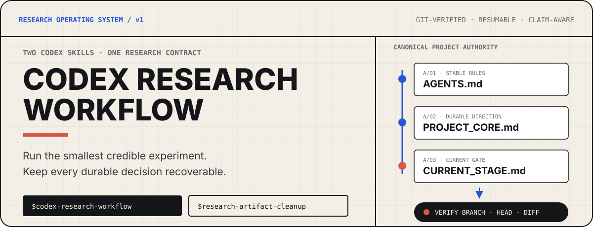
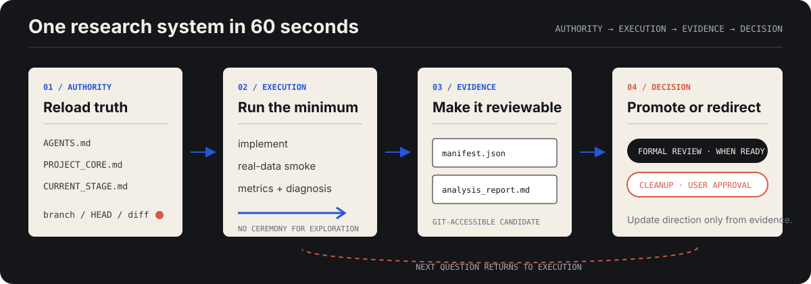
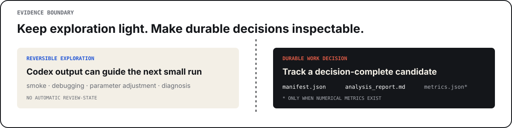
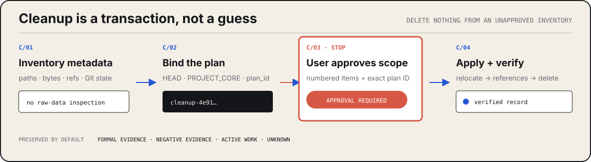

<p align="right"><strong>English</strong> · <a href="./README.zh-CN.md">简体中文</a></p>

<p align="center">
  
</p>

# Codex Research Workflow

Two progressive-disclosure Codex Skills for research repositories that must move quickly without losing the exact state of the work.

- **`$codex-research-workflow`** keeps Git identity, durable direction, the current Gate, experiments, evidence, reviews, and handoffs coherent.
- **`$research-artifact-cleanup`** removes obsolete research artifacts only through an explicit, state-bound plan approved by the user.

Exploration stays lightweight. Decisions that change a method, baseline, data split, metric, stopping rule, or paper claim become Git-accessible evidence.

<p align="center">
  
</p>

## Why this exists

Long-running research drifts when chat summaries, stale reports, old runs, and the working tree quietly disagree. This workflow gives Codex and Browser Work a small, canonical surface to reload before acting—without turning ordinary implementation, smoke tests, or exploratory runs into review bureaucracy.

The operating rule is simple:

```text
minimal implementation → real-data run → metrics → diagnosis → direction adjustment → paper evidence
```

## Two Skills, one contract

| Skill | Owns | Does not do |
|---|---|---|
| [`$codex-research-workflow`](./skills/codex-research-workflow/SKILL.md) | initialization, migration, authority audit, experiment manifests, evidence candidates, review state, resume prompts | inflate every exploratory step into a formal Gate |
| [`$research-artifact-cleanup`](./skills/research-artifact-cleanup/SKILL.md) | metadata inventory, six cleanup classifications, immutable plan identity, relocate/delete/verify phases | infer scientific value or delete from an unapproved inventory |

Every actionable Browser Work Goal invokes the Workflow Skill. Historical or batch cleanup invokes both. The public [Work Response Contract](./skills/codex-research-workflow/references/work-response-contract.md) defines the four-section Work response format and formal-review boundary.

## First successful run

Install the repository Skills:

```bash
npx skills add Dreiot/codex-research-workflow
```

Then audit an existing governed project:

```powershell
py -3 "$env:USERPROFILE\.codex\skills\codex-research-workflow\scripts\workflow.py" audit --repo C:\path\to\project
```

The Codex-opened project root and exact Git root must be the same directory.
Nested or split-root project layouts stop for an explicit root migration.

For an older governed project, preview migration before changing anything:

```powershell
py -3 "$env:USERPROFILE\.codex\skills\codex-research-workflow\scripts\workflow.py" migrate --repo C:\path\to\project
```

`init` and `migrate` are plan-first. Their `--apply` form requires the exact displayed `plan_id`; changed Git or filesystem state invalidates the approval.

## The authority model

| Authority | Time scale | Contains | Excludes |
|---|---|---|---|
| `AGENTS.md` | stable | repository rules, permissions, review/Git boundaries, experiment-root policy | current progress |
| `docs/PROJECT_CORE.md` | durable | research question, main direction, innovation hypotheses, components, synthesized past-direction decisions, claim ceiling | current branch, Gate, or next action |
| `docs/CURRENT_STAGE.md` | current | branch, current Gate, reviewed/accepted identity, findings, one next action | chronological history |

Git and checked-in evidence remain authoritative. Chat summaries are pointers, not state. Existing `codex-project-core` and `codex-handoff-state` markers remain compatible with projects created before the rename.

## Experiments without repository sprawl

The default root is `experiments/`; `AGENTS.md` may declare another project-relative root. Nothing is created until an artifact is actually needed. Cleanup inventory still begins at the whole project root, including ignored local artifacts.

```text
experiments/
├── scripts/       tracked experiment entrypoints
├── configs/       tracked configurations
├── registry/      tracked compact decision and cleanup records
├── evidence/      tracked Work evidence candidates
├── runs/          ignored generated run outputs
├── .tmp/          ignored disposable files and cleanup plans
└── quarantine/    ignored artifacts awaiting a decision
```

Core method code stays in the project's normal source area. Raw and external datasets stay outside this root.

<p align="center">
  
</p>

Create `experiments/evidence/<experiment-id>/<candidate-id>/` before Browser Work adopts a result or changes the direction, method, baseline, data split, metric, or claim from it. A candidate contains `manifest.json`, `analysis_report.md`, and `metrics.json` only when numerical metrics exist. Structural validation proves accessibility and integrity—not scientific sufficiency.

## Cleanup that stops for approval

<p align="center">
  
</p>

Cleanup uses exactly seven classifications:

| Preserved | Deletable only with evidence and approval |
|---|---|
| `keep_formal_evidence` · `keep_negative_evidence` · `keep_active` · `unknown` | `delete_reproducible` · `delete_technical_failure` · `delete_user_retired` |

`delete_user_retired` records an exact user retirement decision and the compact
evidence retained in its place. It still requires approval of the generated,
state-bound plan ID and cannot override formal, negative, active, or unresolved
evidence protection.

A committed `PROJECT_CORE.md` change triggers a read-only cleanup plan only when it actually retires, rejects, supersedes, or makes a primary direction obsolete. Wording, citation, evidence-level, and claim-narrowing edits do not trigger cleanup. The detailed plan remains ignored; important verified transactions create `experiments/registry/cleanup/<cleanup-id>.json`.

## Review only when the stakes change

| Lane | Review behavior |
|---|---|
| exploration | implementation, smoke, debugging, parameter adjustment, metrics, and diagnosis proceed without review-state recording |
| natural implementation candidate | Browser Work reviews the exact pushed diff before the code becomes a stable dependency; no formal state transaction by default |
| formal promotion | one qualified review to accept a major baseline, freeze publication evaluation, adopt a key result, change the core method, or raise a claim |

Formal verdicts are `ACCEPT`, `ACCEPT_WITH_P2`, `REJECT`, and `BLOCKED`. P0/P1 requires `REJECT`; P2 is non-blocking. A mechanical verification is not another review.

## Command surface

| Command | Purpose |
|---|---|
| `workflow.py init` | plan and initialize a new `main` repository after Git/GitHub safety checks |
| `workflow.py migrate` | add current policy without moving artifacts or rewriting scientific content |
| `workflow.py audit` | fail closed on material authority or Git conflicts |
| `workflow.py prepare-experiment` | create an ignored `research-experiment-run/v1` manifest on demand |
| `workflow.py prepare-evidence` | scaffold a tracked `research-evidence-candidate/v1` packet |
| `workflow.py validate-evidence` | validate schema, report structure, hashes, and Git accessibility |
| `workflow.py record-review` | record one explicit formal-promotion result |
| `workflow.py resume-prompt` | generate a compact Codex or Browser Work restart prompt |
| `cleanup.py plan` | inventory approved paths and generate an ignored, state-bound plan |
| `cleanup.py apply` | execute `relocate`, `delete`, or `verify` for the approved plan ID |

`initialize` remains an undocumented compatibility alias for legacy missing-file-only automation.

## Hooks, limits, and compatibility

- The optional `SessionStart` Hook is read-only and fail-open; it injects only a compact authority/Gate pointer. Explicit `audit` remains fail-closed.
- Reviewer hooks retain the formal-review boundary and do not turn a consulted reviewer into a state transaction.
- New-project initialization refuses nested repositories, suspicious upload scope, sensitive/oversized files, and non-empty remote history. It never force-pushes.
- Cleanup inventory reads metadata, tracked references, and Git state—not large run contents or raw datasets—to assign no classification by itself.
- The compatibility Contract path remains byte-identical so existing ChatGPT Work project instructions continue to resolve after the rename.

## Verified here

The repository currently exercises initialization and `main` push, migration, on-demand experiment manifests, evidence validation, review-state semantics, Hook behavior, cleanup plan identity, approved deletion, and cleanup verification through **11 integration tests** on Windows and Linux CI targets.

```bash
python -m py_compile skills/codex-research-workflow/scripts/workflow.py skills/codex-research-workflow/scripts/hook.py skills/research-artifact-cleanup/scripts/cleanup.py
python -m unittest discover -s tests -v
```

See [CONTRIBUTING.md](./CONTRIBUTING.md) for contribution checks. Licensed under [Apache-2.0](./LICENSE).
