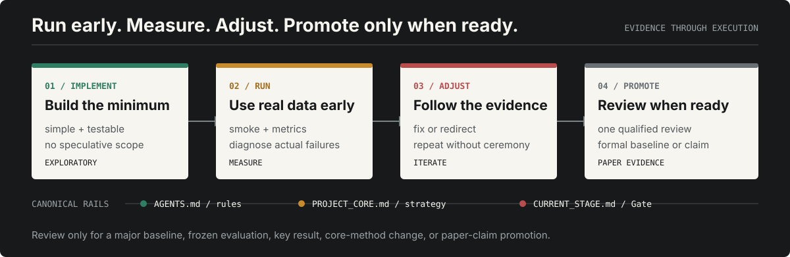

<p align="right">
  <a href="./README.md">English</a> · <strong>简体中文</strong>
</p>

<p align="center">
  
</p>

长期科研任务容易在多轮对话、自动压缩和跨任务切换后发生状态漂移。**Codex
Research Handoff** 将操作规则、科研战略和当前 Gate 分别写入仓库中的三份权威文件，
使用确定性脚本核验 schema 与 Git，并在任务恢复或自动压缩后重新注入摘要。

它适用于科研软件、论文实验流水线、证据 Gate，以及任何不能只依赖“看起来合理的聊天总结”
的项目。

## 三层权威协议

| 权威文件 | 时间尺度 | 负责内容 | 禁止承担 |
| --- | --- | --- | --- |
| `AGENTS.md` | 稳定 | 操作规则、权限、验证、Git、审查和 claim 边界 | 当前 Gate 或临时进度 |
| `docs/PROJECT_CORE.md` | 长期 | 研究问题、目标贡献、创新假设、组件图谱、已探索方向、证据等级和 claim 上限 | branch、HEAD、当前 verdict 或下一动作 |
| `docs/CURRENT_STAGE.md` | 动态 | 分支、当前 Gate、被审查 candidate、verdict、未解决问题和唯一下一动作 | 长篇战略或项目历史 |

这种拆分可以防止旧交接总结悄然变成第二个真相来源。

<p align="center">
  
</p>

## Skill 能做什么

| 命令 | 结果 | 是否写文件 |
| --- | --- | --- |
| `audit` | 校验两个 JSON 状态块、必需章节、报告路径、Git 祖先关系、项目标识和旧交接文件 | 否 |
| `initialize` | 只创建缺失文件，并使用明确标记为 unaudited 的保守占位内容 | 是 |
| `record-review` | 将精确 candidate SHA、固定 verdict、findings、报告路径和下一 Gate 写入 `CURRENT_STAGE.md` | 是 |
| `resume-prompt` | 生成 Codex 或浏览器审查对话的短恢复 Prompt | 否 |

生命周期 Hook 会在启动、恢复、清空和自动压缩时注入精简的战略/Gate 摘要，并在
review-state commit 与 push 前后发出警告。**Hook 永远不会修改仓库。**

## Browser Work 输出契约

生成的 Work 恢复 Prompt 会链接公开的
[输出契约](./skills/maintain-codex-handoff/references/work-response-contract-v1.md)。
Work 的回复固定为审查结果、设计目标、验收目标，以及一个只包含单一 Codex Goal 的
Markdown 指令块。candidate 审查落库和下一 candidate 必须分开；对 review-state
commit 的机械验收不会再产生 acceptance commit。

## 安装

```bash
npx skills add Dreiot/codex-research-handoff
```

也可以直接让 Codex 安装：

```text
请从 https://github.com/Dreiot/codex-research-handoff 安装 Skill，
路径为 skills/maintain-codex-handoff。
```

安装后的调用名保持为：

```text
$maintain-codex-handoff
```

## 第一次使用

Windows PowerShell：

```powershell
py -3 "$env:USERPROFILE\.codex\skills\maintain-codex-handoff\scripts\handoff.py" initialize --repo C:\项目路径
py -3 "$env:USERPROFILE\.codex\skills\maintain-codex-handoff\scripts\handoff.py" audit --repo C:\项目路径
```

macOS 或 Linux：

```bash
python3 ~/.codex/skills/maintain-codex-handoff/scripts/handoff.py initialize --repo /项目路径
python3 ~/.codex/skills/maintain-codex-handoff/scripts/handoff.py audit --repo /项目路径
```

`initialize` 不会推断科研结论。它只创建 `unaudited` 的 `PROJECT_CORE.md`，之后必须由
项目负责人或合格审查者根据仓库证据完成战略审计。

## 配置 Hook 与独立审查者

将 [hooks.template.json](./examples/hooks.template.json) 中需要的条目合并到
`~/.codex/hooks.json`，不要覆盖已有 Hook。Windows 模板使用 `%USERPROFILE%`；如果
当前 Hook runner 不展开环境变量，请改成绝对路径。

[research-reviewer.toml](./examples/research-reviewer.toml) 是可选的只读审查者，安装到
`~/.codex/agents/research-reviewer.toml`。当浏览器 ChatGPT 已经完成合格的独立审查时，
不应再重复启动它。

## 审查规则

一个 candidate 只需要一次合格的独立审查：

- 浏览器审查必须独立于实现，明确 exact base/candidate SHA，检查真实 diff 与证据，
  并返回 P0/P1/P2 与固定 verdict。
- 只有在缺少合格浏览器审查、证据不完整或冲突、或用户要求第二意见时，才使用
  `research-reviewer`。
- P0/P1 必须 `REJECT`；只有所有 P2 均明确不阻断时才能 `ACCEPT_WITH_P2`；证据不足
  使用 `BLOCKED`。

Git 历史保持实现与审查状态分离：

```text
candidate implementation commit
review-state governance-docs commit
```

## 自动压缩不等于交接

自动压缩是同一个 Codex 任务内的正常连续性，不需要停手、强行 checkpoint commit 或
新建任务。应在证据改变权威状态时落库；只有主动新建 Codex/浏览器对话、压缩后确实
丢失关键约束，或到达自然 Gate 边界时，才执行显式交接。

## 安全边界

- Skill 不决定科研结论。
- Hook 只警告和注入上下文，不是权限沙箱。
- 脚本不会自动 commit 或 push。
- 浏览器 ChatGPT 不会自动加载本机 Hook、Skill 或 memory。
- 私有数据、大日志、生成产物和密钥不得进入权威交接文件。
- `CODEX_HANDOFF.md` 和 `LATEST_STATE.md` 被视为旧动态状态文件，避免形成多个真相来源。

## 验证

```bash
python -m unittest discover -s tests -v
python -m py_compile skills/maintain-codex-handoff/scripts/handoff.py skills/maintain-codex-handoff/scripts/hook.py
```

测试使用临时 Git 仓库验证初始化幂等性、schema 审计、恢复 Prompt、迁移兼容性和 Hook
只读行为。

## 许可证

[MIT](./LICENSE)
